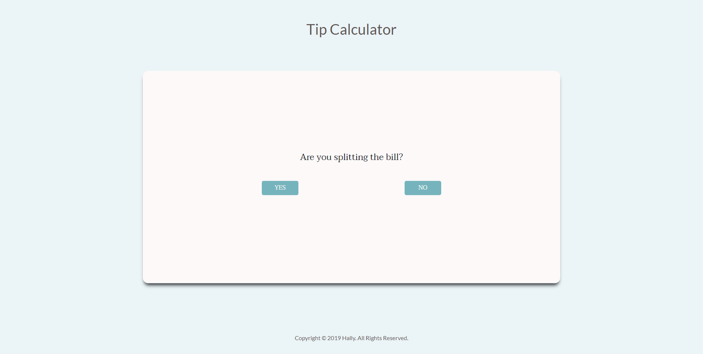
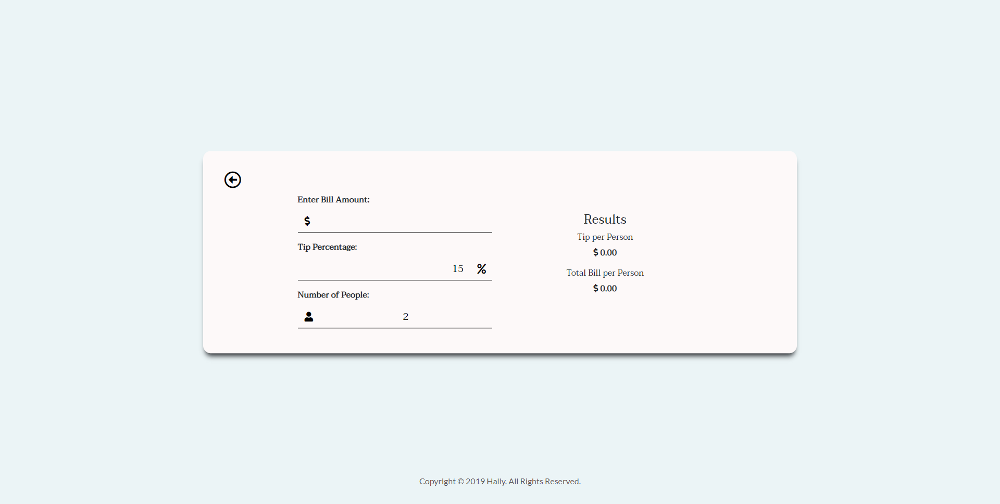
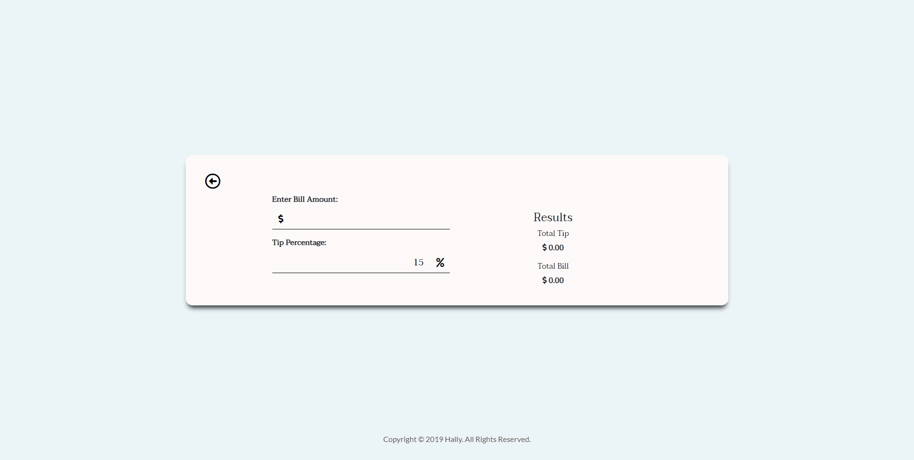

# Tip Calculator [Web]

In this project, it gives the user an option whether it prefers to split the bill or not. If the user picks "No", the app will calculate for the total of the entered bill value and total tip amount. However, if the user chooses "Yes", the app will calculate the same way but will divide to the number of people. Thus, this will produce a result for the total tip amount and the total bill per person.


### Some additional requirements:

:white_check_mark: The bill value must be positive float, but the application must handle user input that might be
    a negative or 0 dollar amount (i.e. error handling).
    
:white_check_mark: The user input percentage for the tip must be a positive float.

:white_check_mark: The return value must be a float rounded to two decimal points (i.e. accurate dollars and cents).

## Technologies
- JavaScript
  - [jQuery](https://jquery.com/)
  - [alertifyjs](https://alertifyjs.com/)
  

## Install
To locally run this project, type these commands to your git bash:


```
git clone https://github.com/itshally/TipCalculator-Web.git

cd TipCalculator-Web

start index.html
```

## Usage
I'm deploying it using Github pages.
  
## Screenshots:

- This is the first view once the app starts running:



- If the user chooses *yes*, this will be the view:



- But, if the user chooses *no*, then this will be the view:



## Demo
Here is a live [demo](https://itshally.github.io/TipCalculator-Web/).

### Author
[Hally](https://github.com/itshally)
